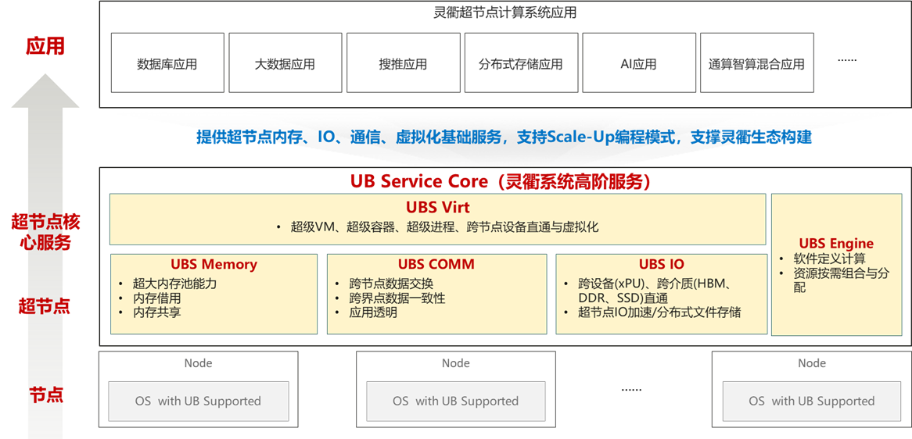

# ubs-core

#### UBS Core 介绍
UBS Core: The UnifiedBus Service Core, 灵衢系统高阶服务，提供超节点内存、IO、通信、虚拟化基础服务，支持Scale-Up编程模式，使能云大数存、AI训推性能提升

#### 软件架构

| 子项目 | 项目简介 | 项目API | 项目Owner|
|--|--|--|--|
| UBS Virt | 超级VM、超级容器、超级进程、跨节点设备直通与虚拟化 | [UBS-Virt](https://atomgit.com/openeuler/ubs-virt) | 龚磊 [@areigonglei](https://atomgit.com/areigonglei), [arei.gonglei@huawei.com](mailto:arei.gonglei@huawei.com) |
| UBS Memory | 超大内存池能力/内存借用/内存共享 | [UBS-Memory](https://atomgit.com/openeuler/ubs-mem) | 刘勇 [@deepsleep_mem](https://atomgit.com/deepsleep_mem), [liuyong776@huawei.com](mailto:liuyong776@huawei.com) |
| UBS COMM | 跨节点数据交换/跨界点数据一致性/应用透明 | [UBS-COMM](https://atomgit.com/openeuler/ubs-comm) | 阮涵 [@ruan-han2001](https://atomgit.com/ruan-han2001), [ruanhan@huawei.com](mailto:ruanhan@huawei.com) |
| UBS IO | 跨设备(xPU)、跨介质(HBM、DDR、SSD)直通，超节点IO加速/分布式文件存储  | [UBS-IO](https://atomgit.com/openeuler/ubs-io)| 李秀桥 [@xiuqiao2025](https://atomgit.com/daxiaomi), [lixiuqiao1@huawei.com](mailto:lixiuqiao1@huawei.com) |
| UBS Engine | 软件定义计算/资源按需组合与分配 | [UBS-Engine API](https://atomgit.com/openeuler/ubs-engine) | 黄林波 [@hlinbo](https://atomgit.com/hlinbo), [huanglinbo1@huawei.com](mailto:huanglinbo1@huawei.com) |
| UBS Atomic | UB分布式原子能力 | [UBS-Atomic API](https://atomgit.com/openeuler/ubs-atomic) | 孟昭慧 [@meng_zhaohui](https://atomgit.com/meng_zhaohui), [mengzhaohui3@huawei.com](mailto:mengzhaohui3@huawei.com) |
| UBS Test | UB Service Core的集成测试用例 | [UBS-Test API](https://atomgit.com/openeuler/ubs-test) | 童金辉 [@tongjinhui](https://atomgit.com/tongjinhui), [tongjinhui@huawei.com](mailto:tongjinhui@huawei.com) |
---

## 应用适配方式

- **零修改**：EulerOS-Matrix提供原生Posix接口，应用无需修改即可获得**10%**收益
- **SDK/RT适配**：应用集成UBS Core加速库/运行时，少量适配可获得**30%**性能收益
- **深度改造**：应用针对UB总线进行深度修改和架构优化，可获得**50%**以上性能增益

#### 参与贡献

1.  Fork 本仓库
2.  新建 Feat_xxx 分支
3.  提交代码
4.  新建 Pull Request

