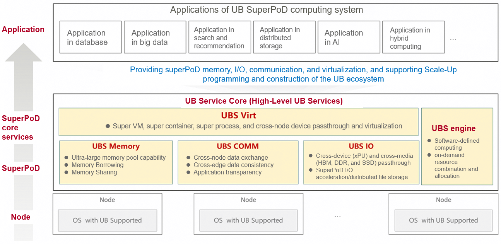

# ubs-core

## Introduction to UBS Core

The UnifiedBus Service Core (UBS Core) provides basic services including superPoD memory, I/O, communication, and virtualization. It supports the Scale-Up programming mode, enabling performance improvement in cloud computing, big data, data storage, and AI training and inference.

## Software Architecture

| Sub-project| Overview| Project API| Project Owner|
|--|--|--|--|
| UBS Virt | Super VM, super container, super process, and cross-node device passthrough and virtualization| [UBS-Virt](https://gitee.com/openeuler/ubs-virt) | Gong Lei [@areigonglei](https://gitee.com/areigonglei), [arei.gonglei@huawei.com](mailto:arei.gonglei@huawei.com)|
| UBS Memory | Ultra-large memory pool capability/Memory borrowing/Memory sharing| [UBS-Memory](https://gitee.com/openeuler/ubs-mem) | Liu Yong [@deepsleepubmem](https://gitee.com/deepsleepubmem), [liuyong776@huawei.com](mailto:liuyong776@huawei.com)|
| UBS COMM | Cross-node data exchange/Cross-edge data consistency/Application transparency| [UBS-COMM](https://gitee.com/openeuler/ubs-comm) | Ruan Han [@ruan-han2001](https://gitee.com/ruan-han2001), [ruanhan@huawei.com](mailto:ruanhan@huawei.com)|
| UBS IO | Cross-device (xPU) and cross-media (HBM, DDR, and SSD) passthrough, superPoD I/O acceleration/distributed file storage | [UBS-IO](https://gitee.com/openeuler/ubs-io)| Li Xiiaoqiao [@daxiaomi](https://gitee.com/daxiaomi), [lixiuqiao1@huawei.com](mailto:lixiuqiao1@huawei.com)|
| UBS Engine | Software-defined computing, on-demand resource combination and allocation| [UBS-Engine API](https://gitee.com/openeuler/ubs-engine) | Huang Linbo [@hlinbo](https://gitee.com/hlinbo), [huanglinbo1@huawei.com](mailto:huanglinbo1@huawei.com)|

## Application Adaptation Method

- **No modification**: EulerOS-Matrix provides native POSIX interfaces, allowing applications to obtain **10%** gains without any modification.
- **SDK/RT adaptation**: When applications integrate the UBS Core acceleration library or runtime, a small amount of adaptation can yield **30%** performance gains.
- **In-depth reconstruction**: In-depth modification and architecture optimization on the UB bus can yield over **50%** performance gains.

## How to Contribute

1. Fork this repository.
2. Create a Feat_*xxx* branch.
3. Commit code.
4. Create a pull request (PR).
