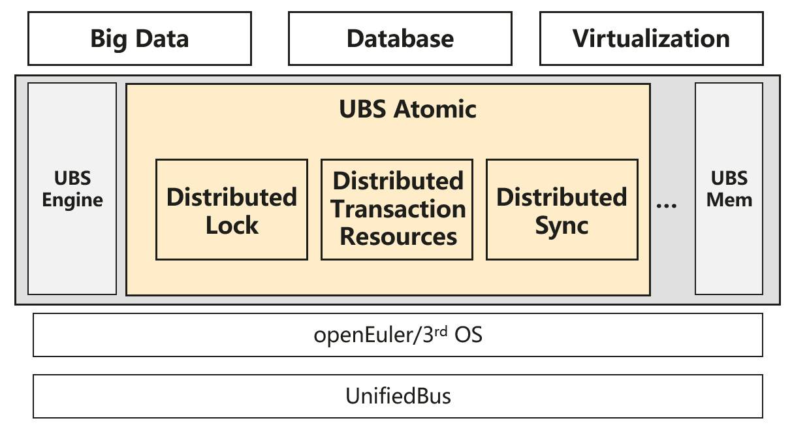

# 增加UB分布式原子能力的提案

## 1. 概述
### 1.1 简介
随着超节点架构的发展，其提供的统一资源视图、低时延互联和高效协同能力，正在成为构建新一代高性能分布式系统的重要基础。传统分布式基础设施依赖网络通信和中心化协调，在低时延、高并发场景下面临性能瓶颈，难以充分发挥超节点硬件优势。  
为此，提出增加UB分布式原子能力 - UBS Atomic。该组件基于统一内存序模型和原子操作能力，构建面向超节点的高性能分布式原子能力，为上层系统提供统一的分布式锁、事务管理和消息通信能力。

### 1.2 目标
UBS Atomic的核心目标是打造灵衢系统统一的分布式原子能力底座，重点解决以下问题：
1. 解决跨节点加锁开销高、时延大的问题；
2. 提供高性能的一致性管理能力；
3. 提供低时延、高吞吐的节点间通信能力；  

基于UB共享内存和原子操作能力，形成“分布式锁 + 事务资源 + 消息同步”三大核心模块，为上层提供标准化、高性能、可扩展的分布式基础服务。

其典型使用场景如下：
1. **数据库场景**：基于超节点共享内存，实现数据库的页面管理与恢复，支撑高性能多主架构。
2. **多节点通信**：利用无锁消息队列，实现多节点间的高性能通信，灵活的优先级与流控管理策略。

## 2. 方案设计
UBS Atomic的软件构如下：

Distributed Lock：基于UB原子操作实现分布式读写锁、互斥锁、自旋锁，用于跨节点数据读写并发控制。  
Distributed Transaction Resources：基于UB原子操作提供全局事务资源分配能力，用于全局事务控制。  
Distributed Sync：基于UB共享内存中的消息队列实现节点间进程通讯、事件通知。