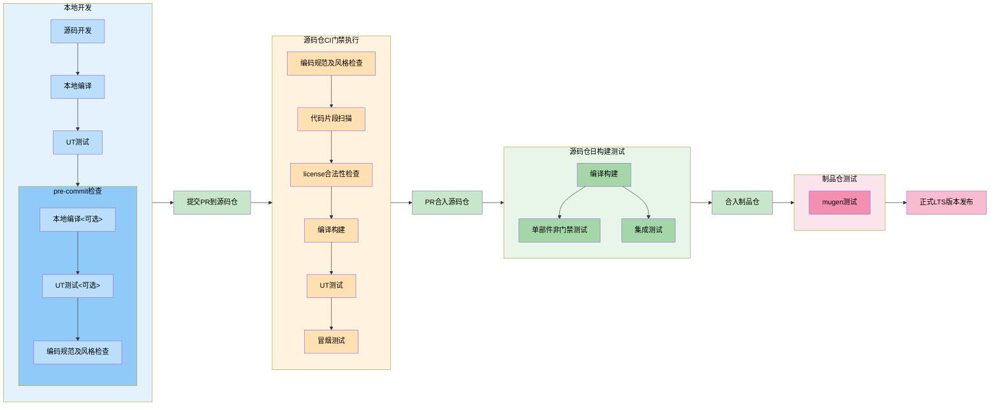

**状态 (Status):** Draft

**作者 (Authors):** 

**创建日期 (Created):** 2026-04-15

**更新日期 (Updated):** 2026-04-15

**相关 Issue/PR:** 

---

# 1. 概述

## 1.1 简介

本文档定义了 UB-ServiceCore SIG 的工程能力要求和标准，旨在确保项目代码质量、开发效率和持续交付能力。

## 1.2 动机

为了规范 UB-ServiceCore 相关项目的工程实践，提升代码质量和开发效率，建立统一的工程能力标准。

## 1.3 目标

- 明确工程能力要求
- 规范开发流程
- 提升代码质量
- 保障项目可持续性

---

# 2. 工程能力要求

## 2.1 研发发布流程图

## 2.2 代码规范

| 规范文件名 | 归档位置 |  用途 |
| ---- | ---- | ---- |
| .clang-format | 各子项目代码仓根目录 | 用于开发者在本地执行pre-commit时使用 |
|               | ubs-core/code_rule/ | 用于源码仓CI门禁执行时使用 |
| .clang-tidy   | 各子项目代码仓根目录 | 用于开发者在本地执行pre-commit时使用 |
|               | ubs-core/code_rule/ | 用于源码仓CI门禁执行时使用 |

> 注：规范要以ubs-core/code_rule/中的内容为准，每个仓不能自行修改，修改需要上sig会议讨论，然后各仓同步修改

## 2.3 测试要求

1. 测试活动分为：单子项目测试、系统集成测试、mugen测试
2. 单子项目测试分为：UT/DT，IT两类测试用例，归档路径：/test/UT, /test/IT，代码功能修改需要同步修改UT、IT的内容
3. UT必须能够在开发者环境中能够运行，pre-commit时集成运行
4. UT覆盖率要求：70%，新增代码80%
4. IT中存在门禁用例和非门禁用例，门禁用例必须实现自动化，在CI门禁中运行，保证绝大部分功能可用；非门禁用例可以是一些高阶能力保证，如果允许，尽量放到系统集成测试中
5. 系统集成测试用例独立归档：在sig-ub-servicecore中增加仓（ubs-test）用于承载系统集成测试，修改功能需要同步修改系统集成用例，修改用例要严格评审
6. mugen测试由OpenEuler社区自动执行，ubservicecore各部件提供启停等基础功能，归档到mugen用例仓，修改用例要经sig评审

## 2.4 CI/CD 要求

1. 源码仓的spec和制品仓的spec必须一致，源码仓CI流程会使用该文件进行rpm build
2. CI只对源码仓的特定分支进行质量守护：经过sig评审，并在ubs-core/branch/下记录的分支才受CI守护；各子项目的committer按需拉取的分支没有CI守护能力
3. 由CI守护的分支，合入源码仓的条件：所有PR必须关联issue，所有门禁通过，两个committer vote
4. 无CI守护的分支，代码合入条件：所有PR必须关联issue，两个committer vote
5. 在源码仓CI验证通过后，由CI提供合入到制品仓的能力，但是需要人工触发

## 2.5 分支规则

参考文件[《sig-UB-ServiceCore_分支说明》](./sig-UB-ServiceCore_分支说明.md)

## 2.6 issue规则

参考文件[《sig-UB-ServiceCore_issue规则说明》](./sig-UB-ServiceCore_issue规则说明.md)

