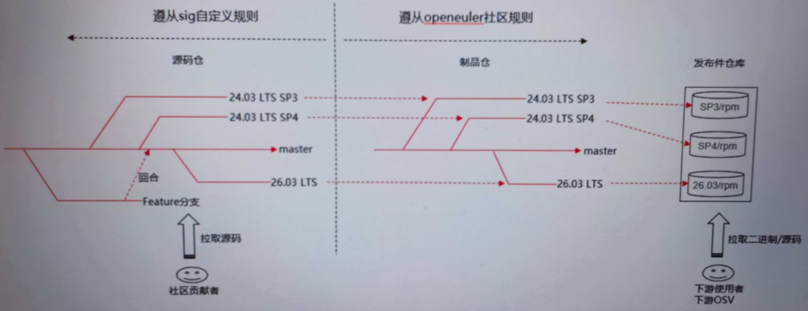

**状态 (Status):** Draft
**作者 (Authors):**  @hlinbo
**创建日期 (Created):** 2026-04-07
**更新日期 (Updated):** 2026-04-07
**相关 Issue/PR:** 

---

# 1. 概述

## 1.1 简介

本文是基于OpenEuler社区运行分支规则的基础上，描述了sig-UB-ServiceCore分支管理规则，指导各项目进行分支操作

## 1.2 动机

sig-UB-ServiceCore在跟随OpenEuler发布，整体遵从OpenEuler的规范

OpenEuler对源码仓没有明确规定，各仓committer可以自行创建分支

同时各分支上的CI/CD门禁能力没有明确说明

本文档遵从OpenEuler社区分支规则，同时自定义规则进行补充

# 2 软件仓介绍

## 2.1 制品仓

制品仓的形式：https://atomgit.com/src-openeuler/ubs-engine

制品仓是全量 RPM 软件包的**源码构建仓**，更像“集成”仓库，从上游拉取源码仓源码，通过 `spec` 文件“加工”成可安装的 RPM 包

制品仓主要用于存放制作发布件（rpm、iso 等）所需的`spec` 文件、源码包（`tar.gz`）和补丁文件（`patch`），其中tar.gz包是取自源码仓的全量软件，patch 是一些修正社区官方发布版本中的缺陷的补丁，spec 文件用于制作 rpm 包

## 2.2 源码仓

源码仓的形式：https://atomgit.co/openeuler/ubs-engine

源码仓是openeuler社区中独立项目的**源码开发仓**，存放独立项目的完整源代码和社区治理文档（`community`）等

遵循“**上游优先**”原则，是项目代码的“首发”和“演进”场所，是 `src-openeuler` 仓的“代码源头”，其代码会被引入 `src-openeuler` 进行打包发布

# 3 分支规则

## 3.1 整体策略

制品仓遵从OpenEuler社区规范

源码仓自定义分支规范，支撑OpenEuler版本发布，支撑特性开发



## 3.2 制品仓分支规则

1. **跟随OpenEuler社区的版本规划，创建相应正式版本对应的分支，不能随意创建分支**


2. **前一版本已经跟随OpenEuler发布（如 24.03 LTS SP3），则默认在下个版本继续跟随OpenEuler发布（如 24.03 LTS SP4），由OpenEuler的CIE负责帮忙创建新版本对应的分支**

3. **首次跟随OpenEuler发布大版本（如 24.03 LTS SP4），需要经过sig-UB-ServiceCore评审通过，然后在[community/src-openeuler](https://gitcode.com/openeuler/community/blob/master/sig/sig-UB-ServiceCore/src-openeuler/u/) 仓提交PR，申请创建分支；最后在该分支上合入：xxx.tar.gz形式全量代码 + spec**

    > 参考：https://gitcode.com/openeuler/community/pull/7223

4. **首次加入OpenEuler某大版本的update（如 24.03-LTS-SP3_update20260323），需要经过sig-UB-ServiceCore评审通过，然后在[community/src-openeuler](https://gitcode.com/openeuler/community/blob/master/sig/sig-UB-ServiceCore/src-openeuler/u/) 仓提交PR，申请创建分支；接着在该分支上合入：xxx.tar.gz形式全量代码 + spec；最后在release-management仓完成[pckg-mgmt.yaml](https://atomgit.com/openeuler/release-management/blob/master/openEuler-20.03-LTS-SP3/everything-exclude-baseos/pckg-mgmt.yaml)的修改**
5. **前一版本已经跟随OpenEuler发布（如 24.03 LTS SP3），下个版本不再跟随OpenEuler发布（如 24.03 LTS SP4），需要经过sig-UB-ServiceCore评审通过，然后知会OpenEuler CIE（参考update发布流程）**
6. **当OpenEuler发布版本的版本号升级时，各部件的版本号也要保证是升级，不能出现版本降级的情况，如24.03 LTS SP3版本号是1.0.0-5，则24.03 LTS SP4版本号至少是1.0.0-5。各团队操作原则：早的分支更新版本号，必须同步更新晚的分支对应的版本号；情况1：每次更新SP3版本号，必须同步更新Next、SP4版本号；情况2：每次更新SP4版本号，必须同步更新Next版本号，SP3版本号维持不变**
> 版本号编制规则：`<version>-<release>`，如 1.0.0-5，表示version为1.0.0，release为5；特性不同，应该version增加，只是bug修复，应该release变更；不允许出现的情况：特性不同、bug修复情况不一致，版本号相同


> **在LST大版本的定义初期（如24.03 LTS SP4初始化阶段），此时OpenEuler的CIE会发邮件通知**
>
> **邮件标题：**[Release] openeuler 24.03-LTS-SP4 分支初始化公示通知
> **收件人：**release@openeuler.org; dev@openeuler.org; cicd@openeuler.org; tc@openeuler.org
> **邮件内容：**
> 各位openeuler社区的maintainer、 committer和contributor们好：
> openEuler-24.03-LTS-SP4分支初始化创建pr已提交，链接为init branch openEuler-24.03-LTS-SP4 from openEuler-24.03-LTS-Next-community-AtomGit | GitCode
> 请涉及各sig的maintainer检视，如无问题请评论/lgtm 。
> 公示7天，闭环意见后，将于4月8日12点合入。

## 3.3 源码仓分支规则

openeuler社区对源码仓没有严格的分支限制，sig可自定义分支，同时openeuler社区对源码仓没有CI/CD守护

**在sig-UB-ServiceCore中定义如下分支规则：**

1. **master分支：master作为持续滚动开发的主干，接纳各开发分支的代码回合，受sig的CI能力守护**
2. **OpenEuler大版本对应的分支（如 openEuler-24.03-LTS-SP3），由sig组评审完版本发布计划，并在[ubs-core/branch/ubs-xxx.yaml](https://gitcode.com/openeuler/ubs-core/branch/) 仓提交PR，然后由CI在对应源码仓创建分支，分支名与制品仓完全相同，受sig的CI能力守护**
3. **关键特性分支：经过sig-UB-ServiceCore例会评审，并在[ubs-core/branch/ubs-xxx.yaml](https://gitcode.com/openeuler/ubs-core/branch/) 仓提交PR，然后由CI在对应源码仓创建分支，受sig的CI能力守护**
4. **自定义分支：由maintainer按需拉取，分支不享受CI/CD能力保证；各申请人需要在[ubs-core/branch/customize.yaml](https://gitcode.com/openeuler/ubs-core/branch/customize.yaml)中增加一行记录，然后联系maintainer，并解释清楚原因**
5. **一般建议按照特性维度拉正式分支，避免分支过多，不再使用的分支要及时删除**
6. **分支名要表达能力特征，不应该携带贡献者所属组织的相关属性**

> ubs-core/branch下创建分支样例（参考community仓）
>
> ```
> name: ubs-engine
> description: xxx.
> upstream: https://atomgit.com/openeuler/ubs-engine
> branches:
>  - name: master
>    type: protected
> 
>  - name: br_noncom_container_20260228
>    type: protected
>    create_from: master
> type: public
> ```